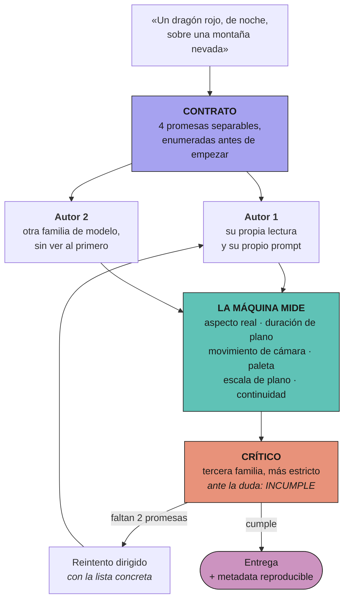
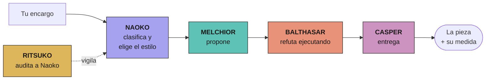
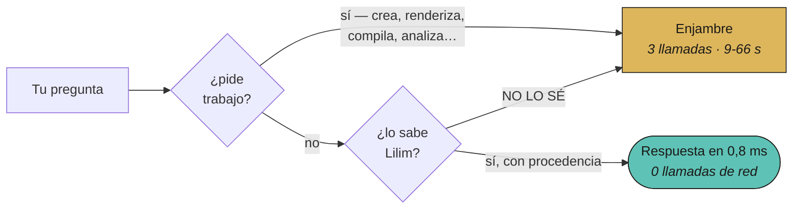
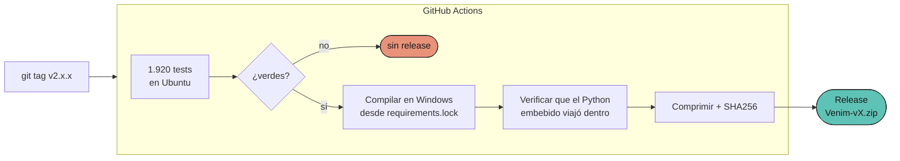

<div align="center">


# Venim

**Imágenes, vídeo y cine. Hechos con criterio, no con suerte.**

Un sistema que no se queda en «salió una imagen»: define qué había que
entregar, lo crea por dos caminos distintos, **lo mide con una máquina** y solo
entonces te lo enseña.

Sin cuenta. Sin clave. Sin instalador. Sin telemetría.

[**⬇ Descargar para Windows**](https://github.com/zero-phoenix/Venim/releases/latest) · [Cómo lo mide](#lo-que-separa-venim-de-pedirle-una-imagen-a-un-modelo) · [Lo que sabe que no sabe](#lo-que-venim-sabe-que-no-sabe-hacer)

</div>

---

## La idea entera, en tres frases

Pedirle una imagen a un modelo y quedarte con lo que salga tiene dos fallos que
no se ven hasta que se miran juntos: **un solo autor no tiene con quién
contrastar**, y **nadie comprueba que lo entregado sea lo pedido**. «Salió una
imagen» se confunde con «salió LA imagen».

Venim convierte tu encargo en un **contrato de promesas separables**, se lo da a
**dos autores que no se ven**, y pone a un **crítico más estricto** —en un
modelo distinto— a contar cuáles se cumplieron. Lo que una máquina puede medir
lo mide una máquina; lo que no, se declara **sin verificar** en vez de aprobarse
por omisión.

Todo lo demás que hay aquí dentro —desensamblar binarios, pilotar emuladores,
consultar datos macroeconómicos— **existe para servir a esa imagen**. No son
funciones sueltas: son las formas de conseguir material real cuando lo que
pides tiene que parecer real.

---

## En una pantalla

| | |
|---|---|
| **Para qué** | Crear imagen, vídeo y películas de alta calidad, con la calidad **medida** |
| **Qué cuesta** | Nada. Ni cuenta, ni tarjeta, ni clave de API en el camino principal |
| **Cómo se instala** | Se descomprime un `.zip` y se ejecuta un `.exe`. No hay paso 3 |
| **Qué lleva dentro** | Su propio Python 3.10, la interfaz compilada y **80 herramientas** reales sobre tu máquina |
| **Cuánto código** | 47.695 líneas de Python · 6.997 de interfaz · **26.872 líneas de tests** |
| **Cuántas pruebas** | **1900 tests en Python**. Sin verdes, no hay release — y eso lo decide el CI |

---

## Lo que separa Venim de pedirle una imagen a un modelo



**Cuando la máquina y el modelo discrepan, manda la máquina.** Los modelos
gratuitos no tienen visión: el crítico separa lo que **mide** un programa —el
aspecto real del fotograma, cuánto dura el plano, si la cámara se mueve— de lo
que juzga leyendo. Y lo que no ha podido verificar, lo dice.

> **Lo que Venim no finge.** Uno de los dos autores **no genera imágenes**: es
> un chat. Entra como autor de pleno derecho —redacta su lectura del contrato y
> su prompt— y el pincel lo pone el otro. Decirlo es la diferencia entre dos
> puntos de vista reales y un teatro de dos.

---

## Todo lo demás son medios para la imagen

Esta es la parte que hace a Venim distinto de un generador de imágenes, y la que
explica por qué lleva dentro un desensamblador.

| Capacidad | Por qué está aquí |
|---|---|
| **Ingeniería inversa** (Capstone, Unicorn, entropía de Shannon) | Sacar material de donde está: formatos de textura, tablas de paleta, assets dentro de un binario. Una referencia real vale más que una descrita |
| **Emuladores y rondas verificadas** | Capturar movimiento auténtico. Un plano grabado de una consola real es material medible; una descripción de ese plano, no |
| **Datos del mundo real** (FRED, BCE, Banco Mundial, SEC) | Cuando la pieza tiene que ser realista, los datos que aparecen en ella tienen que serlo. Cada uno sale con fuente y fecha |
| **Percepción** (oír, ver la pantalla) | Comprobar que el artefacto **suena** y **se ve**, no que el programa dijo que sí |
| **Fábrica de artefactos** | especificar → generar → ejecutar → **observar** → criticar → iterar |
| **Software** | Crear, modificar y ejecutar código; empaquetar a `.exe` portable |

### El taller de cine

Mide la dirección artística de un vídeo **con un programa**: aspecto real,
duración de plano, movimiento de cámara, paleta, ritmo de los turnos de
diálogo. Congela la referencia en una **biblia de estilo** y juzga cada corte
contra ella.

Se **audita a sí mismo** con material fabricado para suspenderlo, interroga al
perito de visión local con preguntas de control que delatan las alucinaciones, y
**busca** los parámetros de montaje por evolución en vez de por reglas escritas
a mano.

---

## Quién decide qué

Venim reparte el trabajo entre **tres nodos**, cada uno anclado a una familia de
modelos distinta. Si el crítico piensa como el autor, no hay crítica: hay eco.



El sistema **se niega** a poner dos nodos en la misma familia: seguiría
respondiendo —peor, y sin dar un solo error—, así que es una negativa y no un
aviso. **Balthasar no puede escribir**, y eso es lo que le da autoridad: un
crítico que puede arreglar lo que critica acaba arreglándolo en vez de
refutarlo.

---

## LILIM: no llamar es más rápido que llamar rápido

El coste dominante no es pensar: es **esperar**. Los proveedores gratuitos
tardan de 3 a 22 segundos por llamada y una vuelta del enjambre son tres.



Medido aquí: **0,76 a 10,44 ms** para lo indexado. Lilim **no es un modelo y no
razona**: es un índice sobre memoria versionada. Cuando no sabe algo dice
`NO LO SÉ` y escala — un índice que inventa sería más rápido y peor que no
tenerlo.

**La vaina de mielina** envuelve a Balthasar: antes de que critique, un
analizador estático le entrega los defectos objetivos en microsegundos y sin
red, y el prompt le pide lo que un AST no puede ver. Con un **KoboldCpp** local
(`VENIM_KOBOLD=1`) añade además crítica neuronal local; sin él no cuesta nada.

---

## Cómo se mide a sí mismo

Dos bancos, y **sus notas no se promedian**:

| Eje | Qué mide | Con qué corredor |
|---|---|---|
| **Lo que sabe** | aritmética, código, formato, admitir que no sabe | modelo pelado |
| **Si además ve** | respuestas leídas del repositorio al construir el banco | con `read_file`, `grep`, `glob` |

El segundo existe porque un día `read_file` falló **8 de 8 veces** y la nota no
se movió: 47 × 23 sigue siendo 1081 aunque el sistema esté ciego. **Un banco que
no baja cuando el sistema se rompe no mide el sistema: mide al modelo.** Y 100 %
de saber con 0 % de ver da un 50 % que no describe nada.

---

## Anonimato, en concreto

1. **Sin cuenta y sin clave.** El camino principal son sitios guest.
2. **Una sola salida de red, para TODO** — enjambre, navegador, descargas,
   subprocesos.
3. **Nada de tráfico partido.** Con `/vpn estricto on`, si la salida no está, el
   sistema **no sale** en vez de caer a tu línea sin avisar.
4. **Sin telemetría.** Lo medido se queda en `%LOCALAPPDATA%\Venim`.
5. **Sin huella entre sesiones.** `/vpn purgar` borra perfiles, caché y logs.
6. **Credenciales fuera de los informes.**

```
/vpn socks5://127.0.0.1:9050    :: Tor, gratis y sin cuenta
/vpn estricto on                :: sin salida, no se sale
/vpn purgar                     :: borra la huella local
```

---

## Reversibilidad y parada

* **Deshacer.** Antes de tocar un fichero se copia. `undo` lo devuelve, por
  operación o por tarea entera.
* **Parar.** `PARAR ESTA` cancela una conversación; `PARAR TODO` es la parada de
  emergencia, con informe de lo que paró **de verdad**.
* **Aprobar.** Qué ficheros toca el cambio, el diff real, las órdenes que se
  ejecutarán y si los tests pasaron.

Todo en `%LOCALAPPDATA%\Venim`: `workspace`, `media`, `historial.db`, y un
`.json` por render con el contrato, las lecturas de los dos autores, lo que
midió la máquina y el veredicto.

---

## Lo que Venim sabe que NO sabe hacer

`docs/AUTOMODELO.json` — cada afirmación con la prueba que la tumbaría:

| Estado | Afirmación |
|---|---|
| **refutada** | El crítico del taller puede juzgar lo que se ve en la imagen |
| **refutada** | El vídeo generativo funciona en modo cloud |
| **refutada** | El prompt llega entero al proveedor guest *(se corta en 7000 caracteres)* |
| **refutada** | Una sonda mide la salud de un sitio guest *(colgó el CI 124 s)* |
| **sin comprobar** | El taller de arte entrega de extremo a extremo |
| sostenida | Se compila un único exe onefile y se publica en Release |
| sostenida | La salida de red es una sola para todas las capas |

**«Sin comprobar» no es «no funciona».** Es que nadie lo ha puesto a prueba
todavía, y decirlo es más útil que inventar un veredicto.

---

## Instalación



1. Descarga **`Venim-<versión>.zip`** de
   [Releases](https://github.com/zero-phoenix/Venim/releases/latest).
2. Verifica (opcional): `certutil -hashfile Venim-<versión>.zip SHA256` contra
   **`CHECKSUMS.txt`**.
3. Descomprime. Dentro hay **un solo fichero**: `Venim.exe`.

SmartScreen avisará porque el binario no está firmado. El `.exe` es **onefile y
lleva su propio Python 3.10 dentro**. **Hace falta Microsoft Edge** para el
camino guest (medido: Chromium headless recibe 403; el Edge real, 200).

> **Si vienes de Venim**, tu historial, tu carpeta de trabajo y tus
> artefactos se mudan solos la primera vez que abras Venim. Si la mudanza no
> puede hacerse, se te dice y tus datos siguen intactos donde estaban.

### Desde el código

```
python -m venv .venv
.venv\Scripts\pip install -r requirements.txt -r requirements-dev.txt
.venv\Scripts\python -m pytest tests/ -q
powershell -ExecutionPolicy Bypass -File scripts\compilar_local.ps1
```

Opcionales, detectados si están: `pillow` (**sin él el taller de arte no aprueba
nada**, y lo declara como no verificado), `ffmpeg` (vídeo y medidor de estilo),
`opencv-python-headless` (escala de plano), `capstone` y `unicorn` (ingeniería
inversa). Sin ellos el sistema funciona y **avisa de lo que no puede hacer**.

### El cascarón local

Lo único que corre en tu tarjeta, y a propósito lo más pequeño posible. No
genera: **percibe**. Hace lo que ningún proveedor guest puede, porque ninguno
acepta imágenes de entrada.

| Pieza | Para qué | Peso |
|---|---|---|
| `opencv-python-headless` | escala de plano | pip |
| `face_detection_yunet` | detector | 230 KB |
| `face_recognition_sface` | continuidad de personaje | 37 MB |

**No se descargan solos**: bajar ficheros sin que nadie lo pida rompería la
promesa de una sola salida de red. Sin ellos la escala de plano sale como **SIN
MEDIR** — que no es «plano general», y confundirlas aprobaría un corte de
primeros planos contra una biblia de planos generales sin que nadie hubiera
mirado una imagen.

---

## Cómo está construido esto

Cada regla nació de un fallo real, no de un manual de estilo:

1. **Todo cambio se conecta o se borra.**
2. **Un test sobre una pieza aislada no prueba que el sistema la use.**
3. **Cada capacidad tiene que poder invocarse desde la interfaz**, con el nombre
   que este README promete.
4. **Arrancar encuentra fallos que leer no encuentra.**
5. **«No he podido comprobarlo» no es «está bien».** Sin Pillow, el observador
   devolvía «correcto» sobre una captura que nunca llegó a abrir.
6. **El binario publicado no es el mismo programa que el de desarrollo.**
7. **Arreglar algo no es lo mismo que arreglarlo donde importa.**
8. **Lo que abre un navegador no se sondea.**
9. **Los trinquetes bajan, no suben.**
10. **Se escribe con Python, `newline='\n'` y sin BOM.**

### Los trinquetes

Números que **solo pueden bajar**. Si suben, el CI se pone rojo.

| Trinquete | Qué vigila | Techo |
|---|---|---|
| `scripts/huerfanos.py` | Código público que nadie llama | 83 |
| `tests/test_trinquete_de_lineas.py` | Ficheros que crecen sin control | 800 líneas |
| `tests/test_wiring.py` | Capacidades sin cable a la interfaz | 0 sueltas |
| `tests/test_interfaz_pilotable.py` | `<div onClick>` que el teclado no ve | 1, declarado |
| `tests/test_contrato_del_bus.py` | Sucesos publicados que nadie escucha | 0 |

### Reproducir el CI en local

```
python scripts/verificar.py            # lo de cada push
python scripts/verificar.py --todo     # + los que compilan un .exe
```

---

<div align="center">

**1900 tests en Python · sin verdes no hay release.**

</div>
