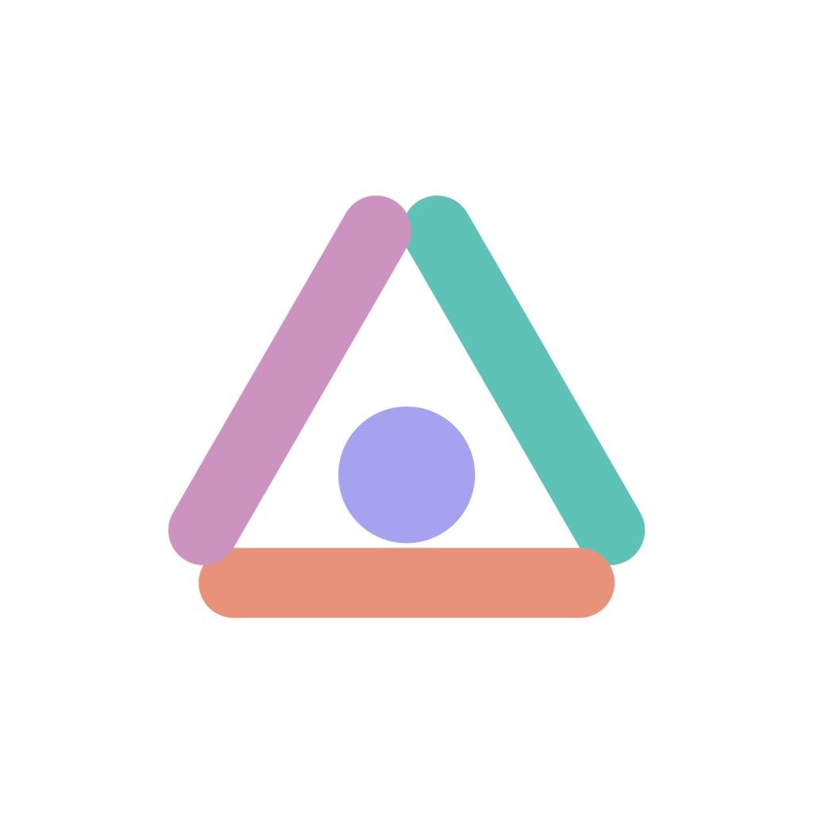
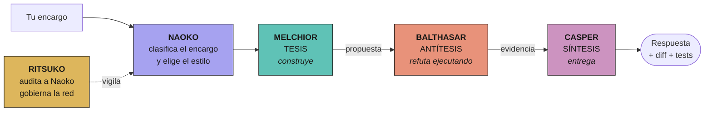
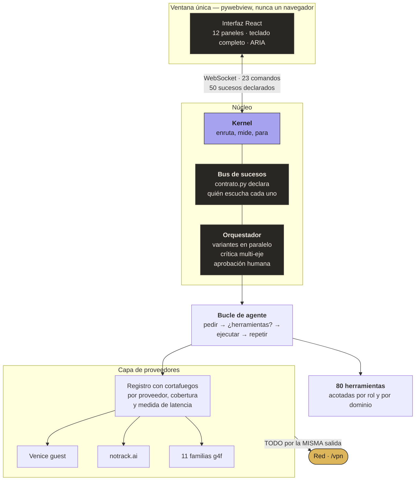
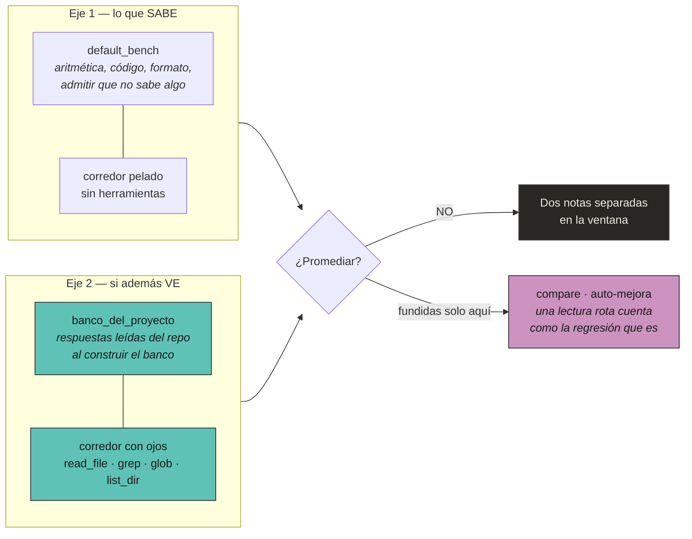
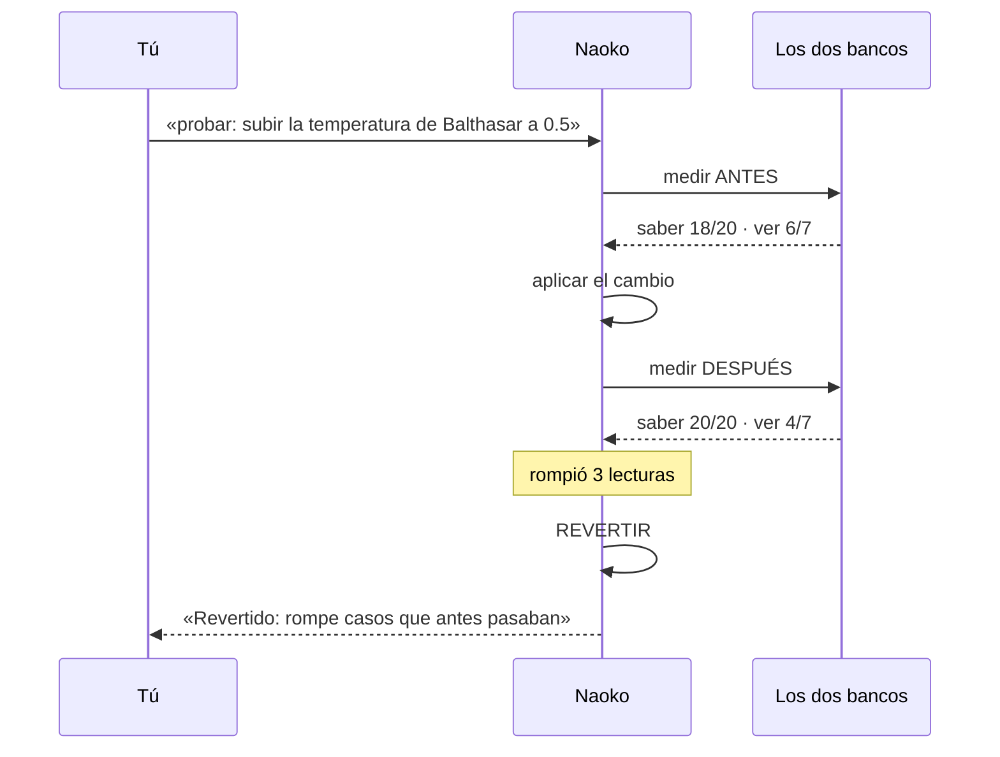
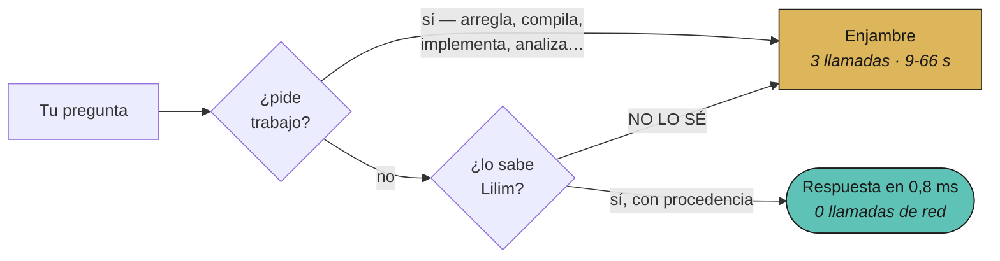
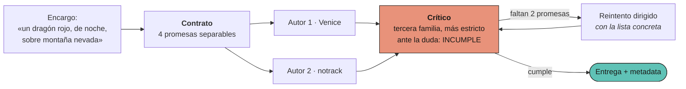
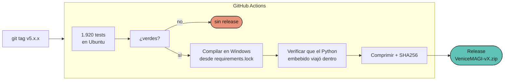

<div align="center">



# VeniceMAGI

**Un IDE donde cinco inteligencias discuten antes de tocar tu código.**
Tesis, antítesis y síntesis — cada una en un modelo distinto, porque un crítico
que piensa igual que el autor no es un crítico, es un eco.

Sin cuenta. Sin clave. Sin instalador. Sin telemetría.

[**⬇ Descargar para Windows**](https://github.com/zero-phoenix/VeniceMAGI/releases/latest) · [Cómo está construido](#cómo-está-construido-esto) · [Lo que sabe que no sabe](#lo-que-el-sistema-sabe-que-no-sabe-hacer)

</div>

---

## En una pantalla

| | |
|---|---|
| **Qué es** | Un entorno de desarrollo con un enjambre dialéctico de 5 roles sobre proveedores de nube gratuitos |
| **Qué cuesta** | Nada. Ni cuenta, ni tarjeta, ni clave de API en el camino principal |
| **Cómo se instala** | Se descomprime un `.zip` y se ejecuta un `.exe`. No hay paso 3 |
| **Qué lleva dentro** | Su propio Python 3.10, la interfaz compilada y **80 herramientas** reales sobre tu máquina |
| **Cuánto código** | 47.695 líneas de Python · 6.997 de interfaz · **26.872 líneas de tests** |
| **Cuántas pruebas** | **1900 tests en Python** (1.920 hoy). Sin verdes, no hay release — y eso lo decide el CI, no yo |

---

## Por qué un enjambre y no un modelo

Un modelo bueno contestando solo tiene un problema que no se ve: **está de
acuerdo consigo mismo**. Le pides una solución, te la da, le preguntas si está
bien, y te dice que sí. No miente — es que no tiene con qué contrastar.

VeniceMAGI parte el trabajo en tres actos y lo reparte entre **tres nodos**
—Melchior, Balthasar y Casper—, cada uno **anclado a una familia de modelos
distinta**. Naoko y Ritsuko no son parte de la disputa: una la organiza y la
otra la audita.



**La restricción que hace que esto funcione:** el sistema **se niega** a poner
dos nodos en la misma familia. Si Melchior propone con el mismo modelo con el
que Balthasar refuta, el programa seguiría respondiendo —peor, y sin dar un
solo error—. Por eso es una negativa y no un aviso.

| Rol | Papel | Familias | Puede escribir |
|---|---|---|---|
| **Naoko** | Clasifica, supervisa, repara | rota entre `command` / `gpt` / `claude` | sí, verificado |
| **Melchior** | Construye la tesis | `venice` + subagentes | sí |
| **Balthasar** | Refuta ejecutando | `notrack` | **no, y es a propósito** |
| **Casper** | Sintetiza y entrega | `gemini` + subagentes | sí |
| **Ritsuko** | Audita a Naoko | `razonamiento` / `grok` / `perplexity` | **no, solo mira** |

Balthasar no puede escribir porque **eso es lo que le da autoridad como
crítico**. Un refutador que puede arreglar lo que critica acaba arreglándolo en
vez de refutarlo, y se pierde la refutación.

---

## Cómo está montado por dentro



**El contenedor de nube es virtual y local.** No ejecuta inferencia: decide
**quién atiende cada capacidad**. Un proveedor que no hace vídeo figura con
`video=False`, y pedírselo devuelve el motivo al instante en vez de esperar
cuatro minutos para contestar «no apareció en el plazo».

### El contrato del bus

Los 50 sucesos que el sistema publica están **declarados en un fichero** con su
destino: los que llegan a la ventana y los que son internos. Los internos
**exigen un motivo escrito** de por qué nadie los ve.

Existe porque en septiembre de 2026 se contaron: **25 de los 50 se estaban
tirando a la basura**, incluidos `swarm.ronda` (qué ronda va, cuántas llamadas
quedan) y `agent.thought` (qué está pensando ahora mismo). El usuario veía
veinte segundos de pantalla en blanco mientras el registro tenía todo el
detalle. Un test compara las dos listas y se pone rojo si vuelven a separarse.

---

## La medida: dos ejes que no se promedian

El sistema se puntúa a sí mismo, y esta es la parte que más veces se ha
equivocado. Hay **dos bancos de evaluación**, y sus notas **no se mezclan**:



**Por qué dos y no uno.** El 5 de septiembre de 2026, pilotando la aplicación,
`read_file` falló **8 de 8 veces**: el enjambre buscaba el código en una carpeta
vacía. El banco de siempre habría dado exactamente la misma nota que el día
anterior, porque 47 × 23 sigue siendo 1081 aunque el sistema esté ciego. **Un
banco que no baja cuando el sistema se rompe no mide el sistema: mide al
modelo.**

**Por qué las respuestas no las escribo yo.** Cada tarea del segundo banco saca
su solución **del repositorio, en el momento de construir el banco**. Si mañana
`MUESTREO_FPS` pasa de 5.0 a 8.0, el banco espera 8.0 sin que nadie lo toque. Un
banco cuyo autor es uno de los dos concursantes no mide: confirma.

**Por qué no se promedian.** 100 % de saber y 0 % de ver da un 50 % que no
describe nada de lo que está pasando.

### El lazo cerrado



La regla de decisión es deliberadamente conservadora: **mejora neta de al menos
dos tareas Y ninguna regresión**. Romper algo que funcionaba pesa más que
arreglar algo que no.

---

## La capa local: no llamar es más rápido que llamar rápido

El coste dominante de este sistema no es pensar: es **esperar**. Los
proveedores gratuitos tardan entre 3 y 22 segundos por llamada, y una vuelta
del enjambre son tres como mínimo. Ninguna optimización de prompt compite con
no hacer la llamada.

**LILIM** es la capa que contesta lo que ya se sabe, en milisegundos:



Medido en esta máquina: **0,76 a 10,44 ms** para lo indexado. Entre 300 y
25.000 veces más rápido que la vuelta que sustituye.

Lilim **no es un modelo y no razona**: es un índice sobre memoria versionada.
Su valor está en la mitad que casi nadie implementa — cuando no sabe algo dice
`NO LO SÉ` y escala al enjambre, en vez de rellenar el hueco. Un índice que
inventa sería más rápido y peor que no tenerlo, porque su invención llega con
la misma cara de seguridad que un dato bueno.

**El freno que lo hace seguro** es una lista de verbos de trabajo. «¿Qué
controles tiene la Vita?» ataja; «arregla el mapeo de controles de la Vita»
NO, aunque contenga las mismas palabras que el índice reconoce.
`tests/test_atajo_local.py` empuja seis encargos de trabajo cargados de
términos indexados: si alguno atajara, el mecanismo se retira.

### La vaina de mielina

En el sistema nervioso, la mielina envuelve el axón y multiplica la velocidad
de conducción. Aquí envuelve a Balthasar: antes de que critique, un analizador
estático recorre el AST de la propuesta y le entrega los defectos objetivos
—un `SyntaxError` con su línea, una función que solo tiene `pass`, un
`except:` desnudo— **en microsegundos y sin red**.

El prompt los da por ciertos y pide lo que un AST no puede ver. Sin esto, la
mitad de las críticas de la primera ronda eran «esto no compila», cuatro veces
en paralelo, a 3-22 s la llamada.

Si además levantas un **KoboldCpp** local (Qwen 2.5 1.5B, gratis, funciona en
CPU sin AVX2), la mielina añade una crítica neuronal local. Sin él no cuesta
nada: la sonda de disponibilidad se recuerda un minuto en vez de repetirse en
cada turno.

> **Lo que no se ha portado, y por qué.** En el proyecto de origen esta capa
> incluía sentidos —ojos (PDF), oídos (audio), brazos (exportar a `.docx`)— y
> cuatro funciones de lubricación neuronal. Al medirlo, **ninguna tenía un solo
> llamante en producción**: tests verdes y cero uso. Portarlas habría sido
> mudar código muerto de un repositorio a otro y llamarlo actualización. Aquí
> está lo que se conecta, y lo que se conecta tiene su test de enganche.

---

## Anonimato, en concreto

No es una postura. Es una lista de cosas que el programa hace y deja de hacer,
cada una con su freno en el código:

1. **Sin cuenta y sin clave.** El camino principal son sitios guest.
2. **Una sola salida de red, para TODO** — enjambre, ventana de Edge, descargas
   y subprocesos.
3. **Nada de tráfico partido.** Media aplicación por la VPN y la otra media por
   la línea de casa correlaciona las dos rutas y anula la VPN. Con
   `/vpn estricto on`, si la salida no está, el sistema **no sale**.
4. **Sin telemetría.** Lo que se mide se queda en `%LOCALAPPDATA%\VeniceMAGI`.
5. **Sin huella entre sesiones.** `/vpn purgar` borra perfiles de navegador,
   caché y registros.
6. **Credenciales fuera de los informes.** Un proxy con usuario y contraseña se
   enmascara antes de escribirse en ningún fichero.

```
/vpn socks5://127.0.0.1:9050    :: Tor, gratis y sin cuenta
/vpn estricto on                :: sin salida, no se sale
/vpn purgar                     :: borra la huella local
/vpn estado                     :: qué salida hay y qué alcance tiene
```

`tests/test_venice_guest.py` comprueba que ningún punto del camino principal
pida credenciales. `tests/test_ritsuko_vpn.py` comprueba que la salida sea
**una sola** y que el modo estricto signifique lo que dice.

---

## Qué sabe hacer

**80 herramientas** reales, repartidas por rol y **acotadas por dominio antes de
entrar al prompt** — una tarea de emuladores no carga el compositor de manga.

| Dominio | Qué hace |
|---|---|
| **Software** | Crear, modificar y ejecutar código; empaquetar a `.exe` portable |
| **Ingeniería inversa** | Desensamblado (Capstone), emulación (Unicorn), entropía de Shannon por regiones, contraste entre corpus de emuladores |
| **Percepción** | Oír si un artefacto suena; clasificar qué hay en pantalla y en qué idioma |
| **Memoria** | Búsqueda FTS5 local sobre bitácora, documentación y código — sin gastar red |
| **Artefactos** | especificar → generar → ejecutar → **observar** → criticar → iterar |
| **Cine** | Mide dirección artística con una máquina (aspecto, duración de plano, movimiento de cámara, paleta, ritmo de diálogo), congela la referencia en una biblia de estilo y juzga cada corte contra ella |
| **Mundo real** | Macro, geopolítica y finanzas con fuentes gratuitas y sin clave (FRED, BCE, Banco Mundial, SEC EDGAR) |

### El taller de arte: dos autores, un crítico



**Lo que el taller no finge:** notrack.ai **no genera imágenes**, es un chat —
entra como autor de pleno derecho y el pincel lo pone Venice. Y los modelos
guest **no tienen visión**: el crítico separa lo que **mide una máquina** de lo
que juzga leyendo, y declara lo que no ha podido verificar en vez de aprobarlo
por omisión. Cuando la máquina y el modelo discrepan, **manda la máquina**.

---

## Reversibilidad y parada

* **Deshacer.** Antes de tocar un fichero se copia. `undo` lo devuelve, por
  operación o por tarea entera. `delete_file` va a papelera con diario.
* **Parar.** `PARAR ESTA` cancela una conversación; `PARAR TODO` es la parada
  de emergencia, con informe de lo que paró **de verdad**.
* **Aprobar.** La misma copia alimenta el panel: qué ficheros toca el cambio,
  el diff real, las órdenes que se ejecutarán y si los tests pasaron.

Artefactos en `%LOCALAPPDATA%\VeniceMAGI`: `workspace`, `media`,
`historial.db`, y un `.json` por render con el contrato, las dos lecturas de
los autores, lo que midió la máquina y el veredicto.

---

## Lo que el sistema sabe que NO sabe hacer

`docs/AUTOMODELO.json` — cada afirmación con la prueba que la tumbaría:

| Estado | Afirmación |
|---|---|
| **refutada** | Una sonda mide la salud de un sitio guest *(exige abrir navegador: colgó el CI 124 s)* |
| **refutada** | El crítico del taller puede juzgar lo que se ve en la imagen |
| **refutada** | El vídeo generativo funciona en modo cloud |
| **refutada** | El prompt llega entero al proveedor guest *(se corta en 7000 caracteres)* |
| **sin comprobar** | El chat guest de Venice / notrack.ai responde de verdad |
| sostenida | Se compila un único exe onefile y se publica en Release |
| sostenida | La salida de red del sistema es una sola para todas las capas |

**«Sin comprobar» no es «no funciona».** Es que nadie lo ha puesto a prueba
todavía, y decirlo es más útil que inventar un veredicto.

---

## Instalación

### Binario para Windows



1. Abre **[Releases](https://github.com/zero-phoenix/VeniceMAGI/releases/latest)**
   y descarga **`VeniceMAGI-<versión>.zip`**.
2. Verifica (opcional): `certutil -hashfile VeniceMAGI-<versión>.zip SHA256`
   contra **`CHECKSUMS.txt`**.
3. Descomprime. Dentro hay **un solo fichero**: `VeniceMAGI.exe`.
4. Ejecútalo.

SmartScreen avisará porque el binario no está firmado: *Más información →
Ejecutar de todas formas*. Va en `.zip` a propósito: Windows y muchos
navegadores bloquean un `.exe` descargado suelto.

El `.exe` es **onefile y lleva su propio Python 3.10 dentro**. **Hace falta
Microsoft Edge** para el camino guest: es lo único que resuelve la atestación de
cliente de Venice (medido: Chromium headless recibe 403; el Edge real, 200).

### Desde el código

```
python -m venv .venv
.venv\Scripts\pip install -r requirements.txt -r requirements-dev.txt
.venv\Scripts\python -m pytest tests/ -q
.venv\Scripts\pyinstaller VeniceMAGI.spec --noconfirm
```

Opcionales, detectados si están: `capstone` y `unicorn` (ingeniería inversa),
`pygame` y `pillow` (**sin Pillow el taller de arte no aprueba nada**, y lo
declara como no verificado), `ffmpeg` (vídeo y medidor de estilo),
`opencv-python-headless` (escala de plano). Sin ellos el sistema funciona y
**avisa de lo que no puede hacer**.

### El cascarón local

Lo único que corre en tu tarjeta, y es a propósito lo más pequeño posible. No
genera: **percibe**. Hace lo que ningún proveedor guest puede hacer, porque
ninguno acepta imágenes de entrada.

| Pieza | Para qué | Peso |
|---|---|---|
| `opencv-python-headless` | escala de plano | pip |
| `face_detection_yunet` | detector | 230 KB |
| `face_recognition_sface` | continuidad de personaje | 37 MB |

Van en `%LOCALAPPDATA%\VeniceMAGI\modelos`. **No se descargan solos**: bajar
ficheros sin que nadie lo haya pedido rompería la promesa de una sola salida de
red. Sin ellos, la escala de plano sale como **SIN MEDIR** — que no es lo mismo
que «plano general», y confundirlas aprobaría un corte de primeros planos
contra una biblia de planos generales sin que nadie hubiera mirado una imagen.

---

## Comandos

```
/magi                          /salud
/modelos [NODO FAMILIA|auto]   /modo cloud|hybrid
/imagen [--ar 16:9] [--seed N] [--quality draft|standard|ultra] PROMPT
/video [--duration 10s] PROMPT            (solo Seedance 2.5+)
/vpn URL|off|estado|estricto on|off|purgar
/notrack show|off|URL          /proxy URL|off
/backend [automatic1111|comfyui]          /quality [draft|standard|ultra]
/sesion   /historial [n]   /galeria [n]   /ayuda   /salir
```

Naoko y Ritsuko **no se pueden reasignar** desde `/modelos`: Naoko rota a
propósito según la petición, y Ritsuko tiene prohibidas las familias que
audita. Ofrecer un mando que rompe una garantía es peor que no ofrecerlo.

<details>
<summary><b>Variables de entorno</b></summary>

```
set CLOUD_ONLY_MODE=1
set RITSUKO_VPN=socks5://127.0.0.1:9050
set RITSUKO_VPN_ESTRICTA=1
set VENICEMAGI_SIN_PUERTA=1          :: no abre la ventana de Edge (CI, tests)
set VENICEMAGI_WORKSPACE=D:\mi\proyecto

:: solo para hybrid
set IMAGE_BACKEND=automatic1111
set AUTOMATIC1111_URL=http://127.0.0.1:7860
set COMFYUI_URL=http://127.0.0.1:8188
set SDXL_CHECKPOINT=Realism Engine SDXL
set SEEDANCE_MODEL=seedance-2.5-text-to-video
```

</details>

---

## Cómo está construido esto

Cada regla nació de un fallo real, no de un manual de estilo:

1. **Todo cambio se conecta o se borra.** Nunca se añade sin conectar.
2. **Un test sobre una pieza aislada no prueba que el sistema la use.**
3. **Cada capacidad tiene que poder invocarse desde la interfaz**, y con el
   nombre que este README promete.
4. **Arrancar encuentra fallos que leer no encuentra.**
5. **«No he podido comprobarlo» no es «está bien».** Sin Pillow, el observador
   devolvía «correcto» sobre una captura que nunca llegó a abrir.
6. **El binario publicado no es el mismo programa que el de desarrollo.**
7. **Arreglar algo no es lo mismo que arreglarlo donde importa.**
8. **Lo que abre un navegador no se sondea.** Una sonda que lanza un Edge real
   cuesta segundos, gasta ración y —medido— cuelga el CI 124 s.
9. **Los trinquetes bajan, no suben.** Cuando el conteo de huérfanos supera el
   techo, se conecta, se adelgaza o se borra. Nunca se sube el número.
10. **Se escribe con Python, `newline='\n'` y sin BOM.** PowerShell mete BOM y
    ya rompió un módulo con un `SyntaxError` que no señalaba a ninguna línea.

### Los trinquetes

Números que **solo pueden bajar**. Si suben, el CI se pone rojo y hay que
conectar, adelgazar o borrar — nunca subir el techo sin escribir por qué.

| Trinquete | Qué vigila | Techo |
|---|---|---|
| `scripts/huerfanos.py` | Código público que nadie llama | 83 |
| `tests/test_trinquete_de_lineas.py` | Ficheros que crecen sin control | 800 líneas |
| `tests/test_wiring.py` | Capacidades sin cable a la interfaz | 0 sueltas |
| `tests/test_interfaz_pilotable.py` | `<div onClick>` que el teclado no ve | 1, declarado |
| `tests/test_contrato_del_bus.py` | Sucesos publicados que nadie escucha | 0 |

### Reproducir el CI en local

```
python scripts/verificar.py            # lo de cada push
python scripts/verificar.py --todo     # + los que compilan un .exe
```

O pieza a pieza:

```
python -m ruff check vmagi/ tests/    # ruff fijado en requirements-dev
python scripts/huerfanos.py --conteo
python -m pytest tests/ -q            # la compuerta entera
```

---

<div align="center">

**1900 tests en Python · sin verdes no hay release.**

</div>
